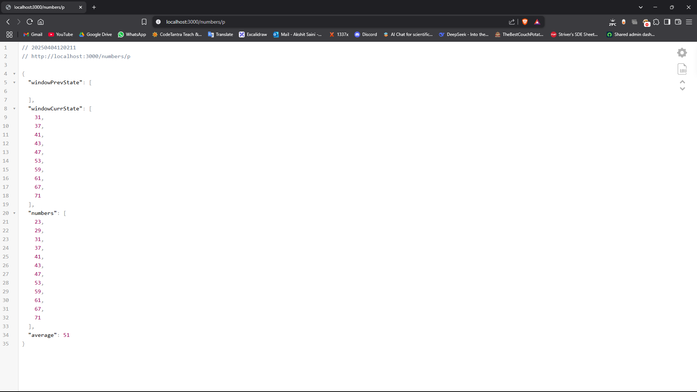
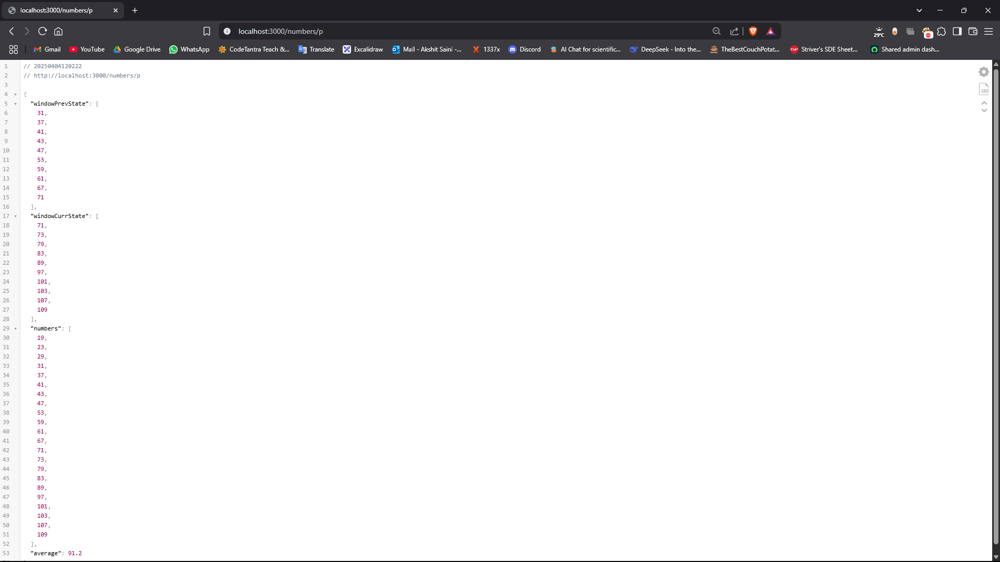
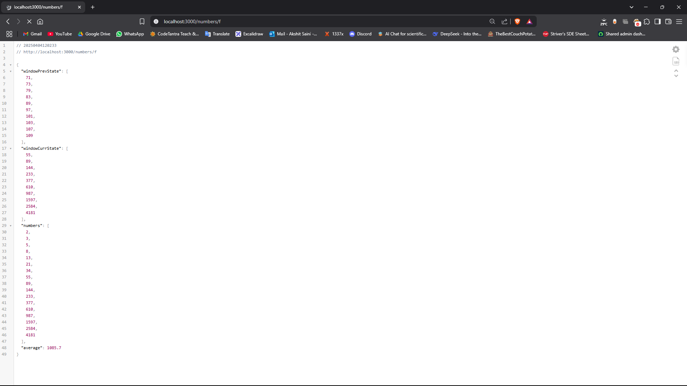
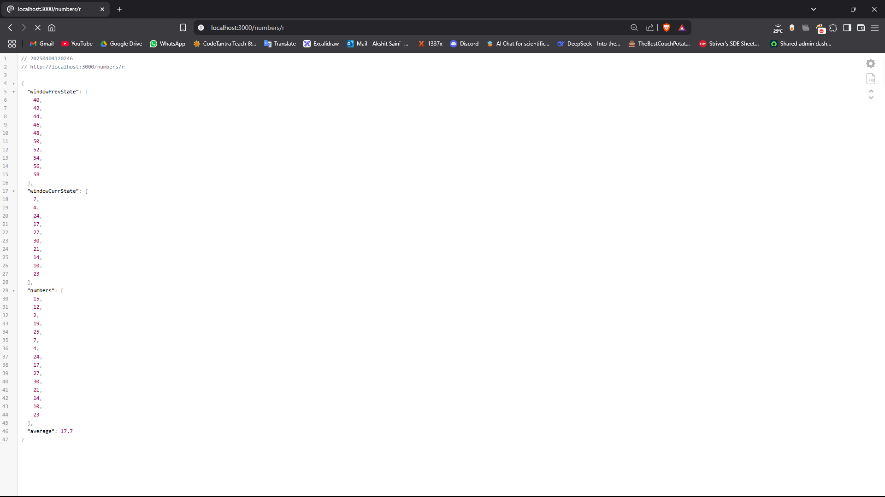
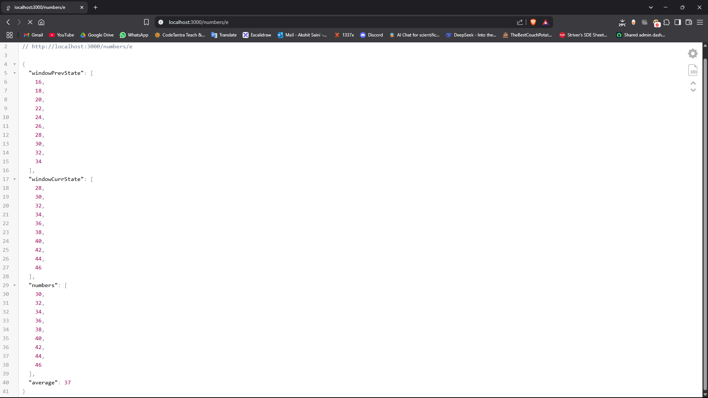

## Average Calculator API – Output Screenshots

### Prime Number API – Request

### Prime Number API – Response

### Fibonacci Number API – Response

### Random Number API – Response

## Even Number API -Response

